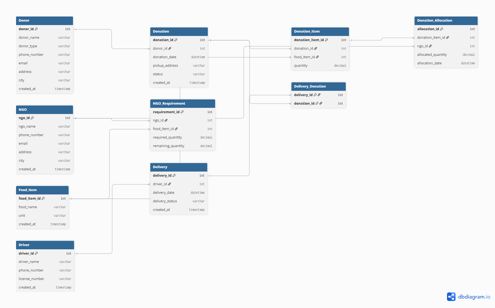
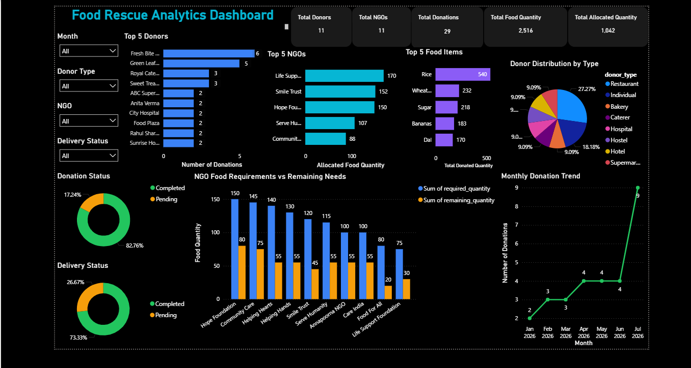

# 🍽️ Food Rescue Analytics Platform

<p align="center">


</p>

An end-to-end **Data Analytics** project built using **MySQL** and **Power BI** to analyze food donations, NGO requirements, food allocation, and delivery performance. The project transforms raw operational data into interactive dashboards that support informed decision-making and improve food distribution efficiency.

---

# 📖 Project Overview

The **Food Rescue Analytics Platform** simulates a real-world food donation ecosystem where donors contribute surplus food, NGOs request food based on their needs, and deliveries ensure that food reaches beneficiaries efficiently.

A normalized relational database was designed and implemented in **MySQL**, with manually created sample data representing realistic food donation scenarios. SQL scripts were used to create the database, populate data, and perform analytical queries. An interactive **Power BI dashboard** was then developed to visualize key metrics, monitor operations, and generate business insights.

---

# 🎯 Objectives

- Monitor donor participation and food donation activities.
- Track NGO food requirements and remaining needs.
- Analyze monthly donation trends.
- Monitor food allocation efficiency.
- Track delivery performance.
- Identify high-performing donors and frequently donated food items.
- Support data-driven decision-making to reduce food waste.

---

# 🛠️ Tech Stack

| Technology | Purpose |
|------------|---------|
| **MySQL** | Database design and storage |
| **SQL** | Database creation, data insertion, and analytical queries |
| **Power BI** | Interactive dashboard and data visualization |
| **Git & GitHub** | Version control and project documentation |

---

# 🗄️ Database Design

The project uses a normalized relational database to represent the complete food rescue process.

### Database Tables

- Donor
- Donation
- Donation Item
- Food Item
- NGO
- NGO Requirement
- Donation Allocation
- Delivery
- Delivery Donation
- Driver

### ER Diagram



---

# 🔄 Project Workflow

```text
Donor
   │
   ▼
Donation
   │
   ▼
Donation Item
   │
   ▼
Food Item
   │
   ▼
Donation Allocation
   │
   ▼
NGO
   │
   ▼
Delivery
```

---

# 📜 SQL Scripts

| Script | Description |
|--------|-------------|
| **01_database_setup.sql** | Creates the Food Rescue Analytics database. |
| **02_tables.sql** | Creates all database tables with primary and foreign key relationships. |
| **03_sample_data.sql** | Inserts sample data into all tables to simulate real-world operations. |
| **04_queries.sql** | Contains analytical SQL queries used for validation and business analysis. |

---

# 📊 Dashboard Preview



---

# 📈 Dashboard Features

## KPI Cards

- Total Donors
- Total NGOs
- Total Donations
- Total Food Quantity
- Total Allocated Quantity

## Interactive Visualizations

- Top 5 Donors by Number of Donations
- Top 5 Food Items by Donated Quantity
- Monthly Donation Trend
- Donation Status Distribution
- Top 5 NGOs by Allocated Food Quantity
- Required vs Remaining Food Quantity by NGO
- Donor Distribution by Type
- Delivery Status Distribution

## Interactive Filters

- Month
- Donor Type
- NGO
- Delivery Status

---

# 💼 Business Problems Solved

| Business Problem | Dashboard Solution |
|------------------|--------------------|
| Identifying the most active donors | Top Donors visualization highlights frequent contributors. |
| Understanding food donation trends | Monthly Donation Trend identifies seasonal donation patterns. |
| Tracking NGO food requirements | Required vs Remaining Food Quantity chart highlights unmet needs. |
| Monitoring food allocation | Top NGOs by Allocated Quantity tracks distribution efficiency. |
| Tracking donation processing | Donation Status Distribution monitors completed and pending donations. |
| Monitoring delivery operations | Delivery Status Distribution tracks delivery completion rates. |

---

# 📊 Key Insights

- **11** active donors contributed food through the platform.
- **11** NGOs receive food assistance.
- A total of **29** food donations were recorded.
- **2,516 units** of food were donated.
- **1,042 units** of food have been allocated to NGOs.
- Fresh Bite Restaurant is the highest contributing donor.
- Rice is the most donated food item.
- Donation activity peaked during **July**.
- Life Support Foundation received the highest allocated food quantity.
- More than **80%** of donations have been successfully completed.
- Several NGOs still have unmet food requirements, highlighting opportunities for future food donations.

---

# 🚀 Future Improvements

- Integrate with a live MySQL database.
- Develop predictive models for donation forecasting.
- Implement automated donor and NGO notifications.
- Optimize delivery routes using route planning algorithms.
- Enable scheduled dashboard refresh.
- Introduce role-based dashboard access.

---

# ▶️ How to Run the Project

1. Clone this repository.

2. Execute the SQL scripts in the following order:

   - `01_database_setup.sql`
   - `02_tables.sql`
   - `03_sample_data.sql`

3. Open the Power BI (`.pbix`) file.

4. Update the MySQL database connection if required.

5. Refresh the dashboard to load the latest data.

---

# 📂 Repository Structure

```text
Food_Rescue_Analytics_Platform
│
├── Dashboard
│   ├── Food_Rescue_Analytics.pbix
│   ├── Food_Rescue_Dashboard.png
│   └── README.md
│
├── Images
│   ├── ER_Diagram.png
│   └── README.md
│
├── SQL
│   ├── 01_database_setup.sql
│   ├── 02_tables.sql
│   ├── 03_sample_data.sql
│   ├── 04_queries.sql
│   └── README.md
│
└── README.md
```

---

# 📌 Project Highlights

- Designed a normalized relational database in MySQL.
- Created realistic sample data to simulate food donation operations.
- Wrote SQL queries for data validation and business analysis.
- Built an interactive Power BI dashboard with KPIs, charts, and slicers.
- Generated actionable insights to improve food distribution and operational efficiency.

---

# 👩‍💻 Author

**Kannika D**

Bachelor of Computer Applications (2025)

GitHub: https://github.com/kannika1610

---

⭐ **If you found this project helpful or interesting, consider giving it a star!**
